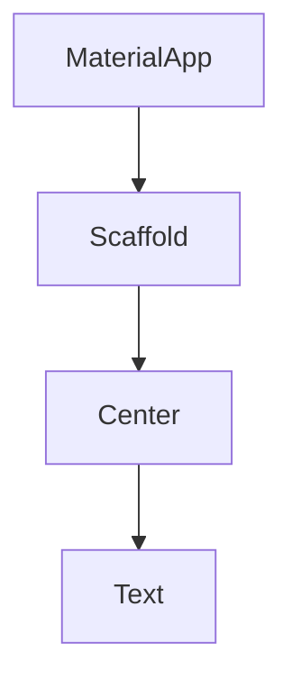
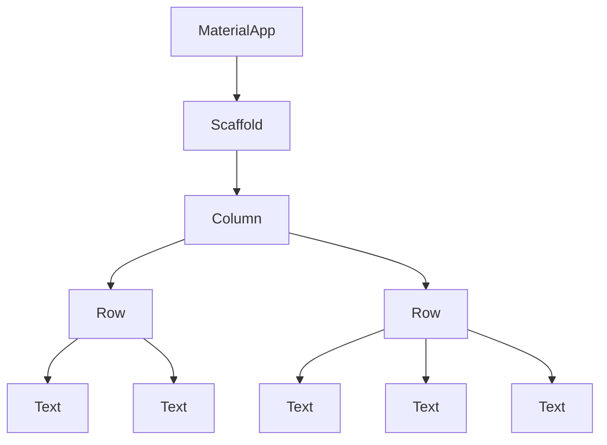

# 위젯 트리란?

- UI를 렌더링하는 데 사용되는 계층 구조를 의미

```dart
import 'package:flutter/material.dart';

// 'android/app/build.gradle'
void main() {
  runApp(
    const MaterialApp(
      home: Scaffold(
        backgroundColor: Colors.black,
        body: Center(
          child: Text(
            'Hello World',
            style: TextStyle(
              color: Colors.white,
            ),
          ),
        ),
      ),
    ),
  );
}
```

- 위 코드의 계층 구조는 아래와 같다.



- 상위에 있는 것을 Parent Widget, 하위에 있는 것을 Child Widget이라고 한다.
- 추후에는 정말 Tree처럼 생긴 위젯 계층 구조를 만나게 될 것

